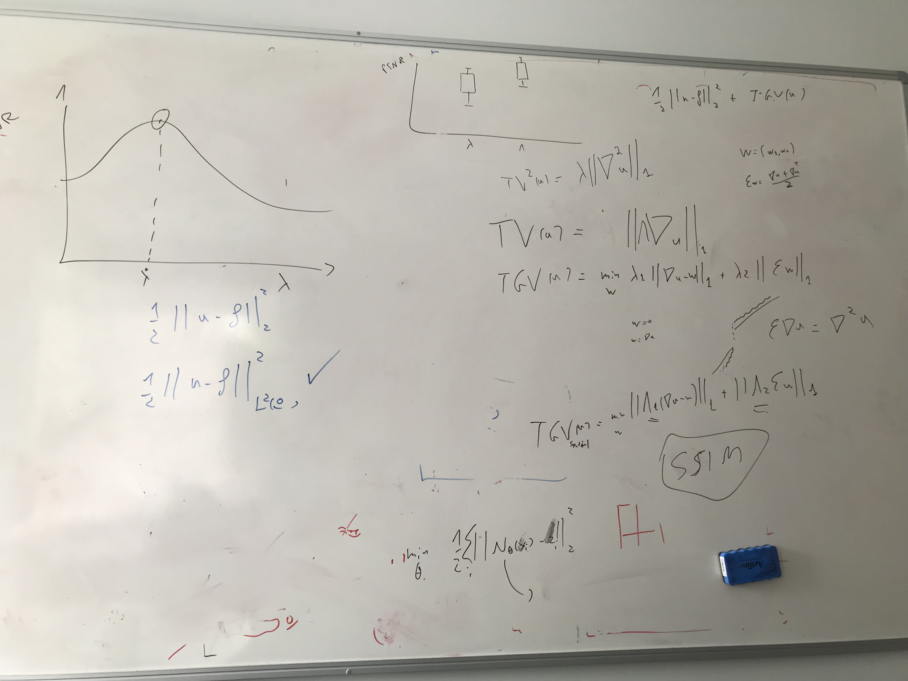

# Meeting 1

- Multiple $T_{\text{train}}$ values (8, 16, ..., 256) against multiple $T_{\text{test}}$ values (8, 16, ..., 4096)

- <s>TODO: Use variable noise [0.1, 0.5] for training</s>
    - Alternative: pre-generate training images for multiple levels of noise: say [0.1, 0.2, 0.3, 0.4, 0.5]?
<s>
- Draw line plots of single lambda values
- Calculate SSIM
- Box plots for PSNR and SSIM
</s>

<s>
- Configurations:
    - Hydra: https://www.youtube.com/watch?v=tEsPyYnzt8s
</s>
